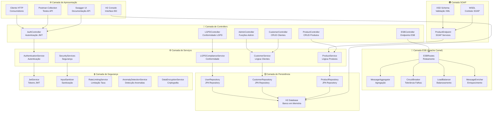
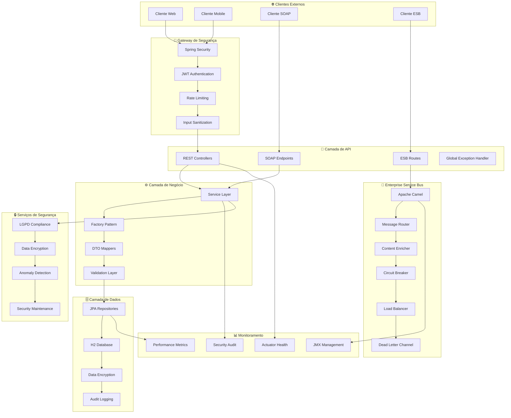
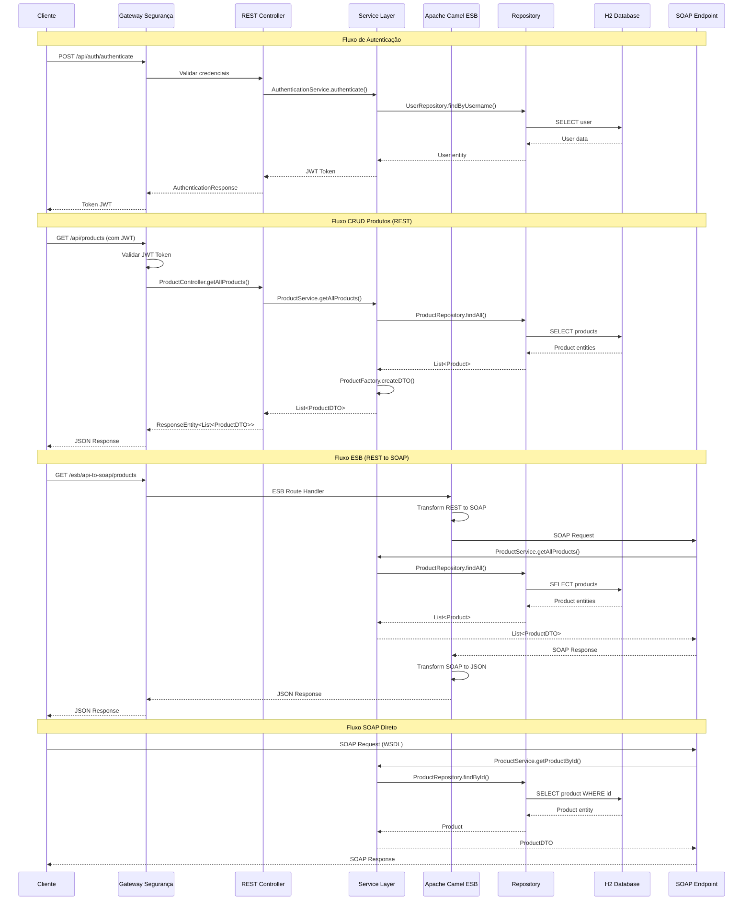
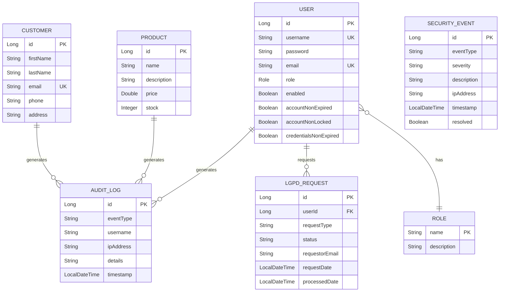
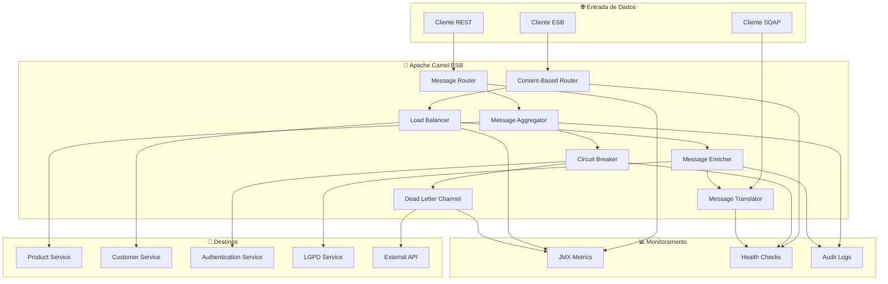
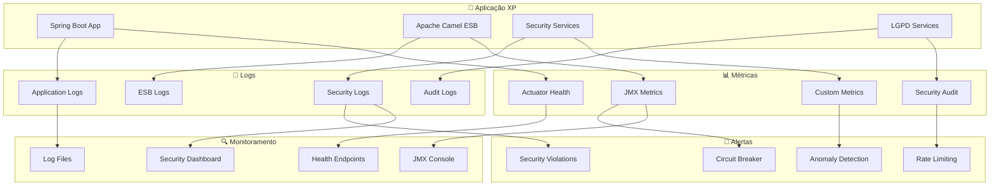

# 🏗️ Diagramas de Arquitetura - Projeto XP

## 📋 Visão Geral

Este documento contém os diagramas de arquitetura do projeto XP, uma aplicação Spring Boot que implementa uma arquitetura orientada a serviços (SOA) com ESB (Enterprise Service Bus) usando Apache Camel.

---

## 🏛️ 1. Arquitetura de Camadas

### Diagrama de Camadas da Aplicação

---

## 🔧 2. Diagrama de Componentes e Integração

### Arquitetura de Componentes

---

## 🌊 3. Diagrama de Fluxo de Dados

### Fluxo de Dados da Aplicação

---

## 🗄️ 4. Diagrama de Entidades (ER)

### Modelo de Dados

---

## 🎯 5. Diagrama de Casos de Uso

### Casos de Uso dos Serviços

```mermaid
graph TB
    subgraph "👤 Ator: Usuário"
        A[Usuário]
    end
    
    subgraph "👨‍💼 Ator: Administrador"
        B[Administrador]
    end
    
    subgraph "🔌 Ator: Cliente Externo"
        C[Cliente Externo]
    end
    
    subgraph "📋 Casos de Uso - Autenticação"
        D[Registrar Usuário]
        E[Autenticar Usuário]
        F[Renovar Token JWT]
    end
    
    subgraph "📦 Casos de Uso - Produtos"
        G[Listar Produtos]
        H[Buscar Produto por ID]
        I[Criar Produto]
        J[Atualizar Produto]
        K[Excluir Produto]
    end
    
    subgraph "👥 Casos de Uso - Clientes"
        L[Listar Clientes]
        M[Buscar Cliente por ID]
        N[Buscar Cliente por Sobrenome]
        O[Criar Cliente]
        P[Atualizar Cliente]
        Q[Excluir Cliente]
    end
    
    subgraph "🔄 Casos de Uso - ESB"
        R[Transformar REST para SOAP]
        S[Agregar Mensagens]
        T[Roteamento Baseado em Conteúdo]
        U[Balanceamento de Carga]
        V[Circuit Breaker]
        W[Enriquecimento de Mensagens]
        X[Dead Letter Channel]
    end
    
    subgraph "🔒 Casos de Uso - LGPD"
        Y[Exportar Dados Pessoais]
        Z[Excluir Dados Pessoais]
        AA[Solicitar Portabilidade]
        BB[Atualizar Consentimento]
    end
    
    subgraph "⚙️ Casos de Uso - Administração"
        CC[Gerenciar Usuários]
        DD[Visualizar Estatísticas]
        EE[Monitorar Sistema]
        FF[Configurar Segurança]
    end
    
    %% Relacionamentos
    A --> D
    A --> E
    A --> F
    A --> G
    A --> H
    A --> L
    A --> M
    A --> N
    A --> O
    A --> P
    A --> Y
    A --> Z
    A --> AA
    A --> BB
    
    B --> CC
    B --> DD
    B --> EE
    B --> FF
    B --> Q
    B --> K
    
    C --> R
    C --> S
    C --> T
    C --> U
    C --> V
    C --> W
    C --> X
```

---

## 🔄 6. Diagrama de Integração ESB

### Padrões ESB Implementados

---

## 📊 7. Diagrama de Monitoramento

### Arquitetura de Observabilidade

---

## 🎯 Resumo da Arquitetura

### **Características Principais:**

1. **🏗️ Arquitetura em Camadas**: Separação clara de responsabilidades
2. **🔄 ESB com Apache Camel**: Padrões de integração enterprise
3. **🔒 Segurança Robusta**: JWT, LGPD, criptografia, auditoria
4. **📊 Observabilidade**: Métricas, logs, health checks
5. **🌐 Múltiplas Interfaces**: REST, SOAP, ESB endpoints
6. **🗄️ Persistência JPA**: H2 com repositórios bem estruturados

### **Padrões Implementados:**

- **Repository Pattern**: Abstração de acesso a dados
- **Factory Pattern**: Criação de objetos DTO/Entity
- **DTO Pattern**: Transferência de dados entre camadas
- **Circuit Breaker**: Tolerância a falhas
- **Message Router**: Roteamento baseado em conteúdo
- **Load Balancer**: Distribuição de carga
- **Dead Letter Channel**: Tratamento de mensagens com erro

---

*Documento criado em: $(date)*
*Projeto: XP Application*
*Versão: 0.0.1-SNAPSHOT*
