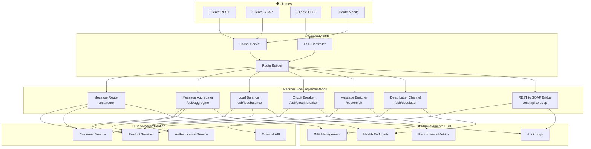
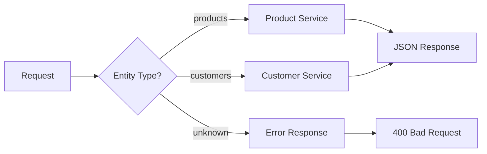
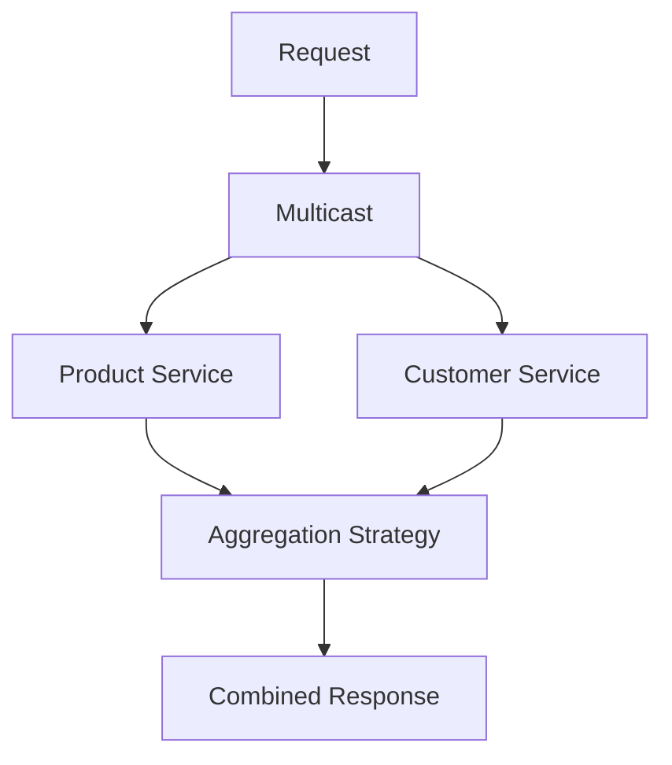
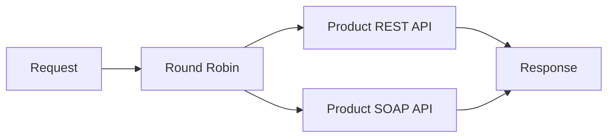
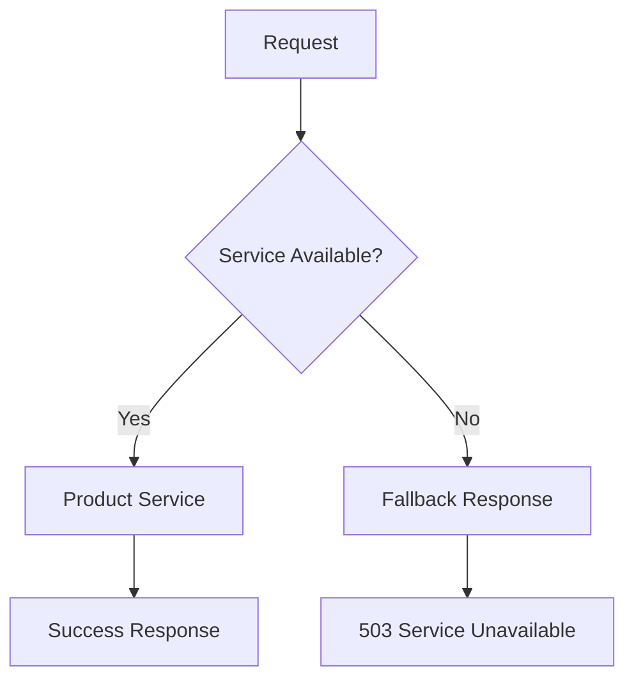
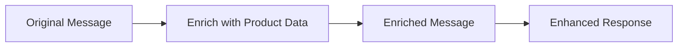
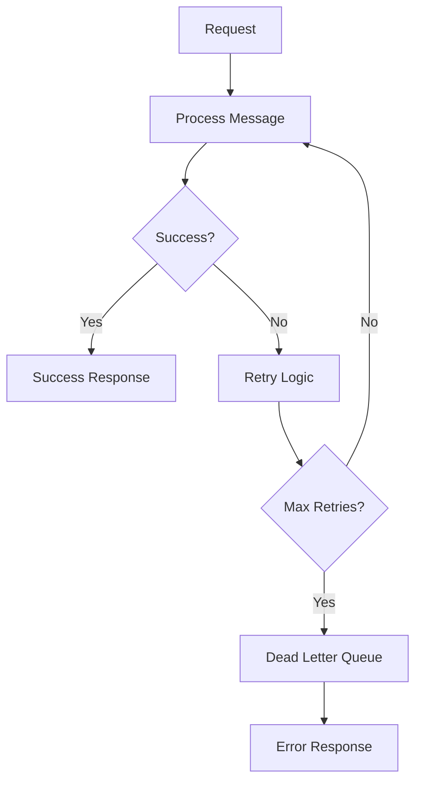
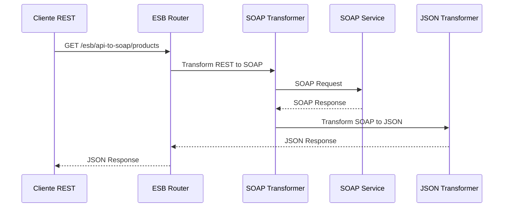
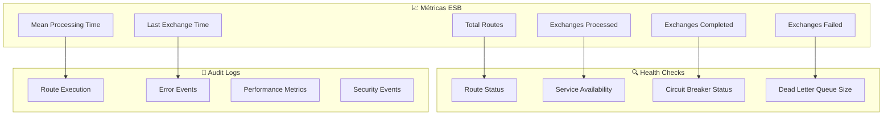

# 🔄 Arquitetura ESB - Projeto XP

## 📋 Visão Geral

Este documento detalha a implementação do Enterprise Service Bus (ESB) no projeto XP usando Apache Camel 4.4.0, demonstrando padrões de integração enterprise.

---

## 🏗️ Arquitetura ESB Detalhada

### Diagrama de Arquitetura ESB



---

## 🔄 Padrões ESB Implementados

### 1. Message Router (Content-Based Router)



**Endpoint**: `/esb/route?entity=products|customers`

### 2. Message Aggregator



**Endpoint**: `/esb/aggregate`

### 3. Load Balancer



**Endpoint**: `/esb/loadbalance`

### 4. Circuit Breaker



**Endpoint**: `/esb/circuit-breaker`

### 5. Message Enricher



**Endpoint**: `/esb/enrich`

### 6. Dead Letter Channel



**Endpoint**: `/esb/deadletter`

### 7. REST to SOAP Bridge



**Endpoint**: `/esb/api-to-soap/products`

---

## 📊 Monitoramento ESB

### Métricas Disponíveis



---

## 🛠️ Configuração ESB

### Estrutura de Rotas

```java
// Exemplo de configuração de rota ESB
from("servlet:///api-to-soap?servletName=CamelServlet")
    .routeId("rest-to-soap-bridge")
    .log("ESB: Processing REST to SOAP transformation")
    .choice()
        .when(header("CamelHttpPath").isEqualTo("/products"))
            .to("direct:getAllProductsSOAP")
        .when(header("CamelHttpPath").regex("/products/\\d+"))
            .to("direct:getProductByIdSOAP")
        .otherwise()
            .setBody(constant("{\"error\":\"Endpoint not found\"}"))
            .setHeader(Exchange.HTTP_RESPONSE_CODE, constant(404))
    .end();
```

### Configurações de Monitoramento

```properties
# ESB Monitoring
camel.springboot.jmx-enabled=true
camel.springboot.jmx-management-statistics-level=Extended
management.endpoints.web.exposure.include=health,info,metrics,camel
management.endpoint.health.show-details=always
```

---

## 🎯 Benefícios da Arquitetura ESB

### 1. **Desacoplamento de Serviços**
- Serviços não precisam conhecer uns aos outros
- Comunicação através de mensagens padronizadas
- Facilita manutenção e evolução

### 2. **Padrões de Integração**
- Implementação de padrões enterprise comprovados
- Reutilização de componentes
- Consistência na integração

### 3. **Tolerância a Falhas**
- Circuit Breaker para serviços indisponíveis
- Dead Letter Channel para mensagens com erro
- Retry automático com backoff

### 4. **Monitoramento e Observabilidade**
- Métricas detalhadas de performance
- Logs estruturados para auditoria
- Health checks para disponibilidade

### 5. **Transformação de Dados**
- Conversão automática entre formatos (REST ↔ SOAP)
- Enriquecimento de mensagens
- Validação de dados

---

## 🚀 Endpoints ESB Disponíveis

| Endpoint | Padrão | Descrição |
|----------|--------|-----------|
| `/esb/api-to-soap` | REST to SOAP Bridge | Converte requisições REST para SOAP |
| `/esb/aggregate` | Message Aggregator | Agrega múltiplas mensagens |
| `/esb/route` | Content-Based Router | Roteia baseado no conteúdo |
| `/esb/loadbalance` | Load Balancer | Distribui carga entre endpoints |
| `/esb/circuit-breaker` | Circuit Breaker | Implementa tolerância a falhas |
| `/esb/enrich` | Message Enricher | Enriquece mensagens com dados adicionais |
| `/esb/deadletter` | Dead Letter Channel | Trata mensagens com erro |

---

## 📋 Resumo da Implementação ESB

### **Características Técnicas:**
- **Framework**: Apache Camel 4.4.0
- **Padrões**: 7 padrões enterprise implementados
- **Monitoramento**: JMX + Actuator + Health Checks
- **Configuração**: Spring Boot Auto-configuration
- **Logging**: MDC logging para rastreamento

### **Benefícios Alcançados:**
- ✅ Desacoplamento de serviços
- ✅ Tolerância a falhas
- ✅ Monitoramento abrangente
- ✅ Transformação de dados
- ✅ Padrões enterprise
- ✅ Escalabilidade
- ✅ Manutenibilidade

---

*Documento criado em: $(date)*
*Projeto: XP Application - ESB Architecture*
*Versão: 0.0.1-SNAPSHOT*
